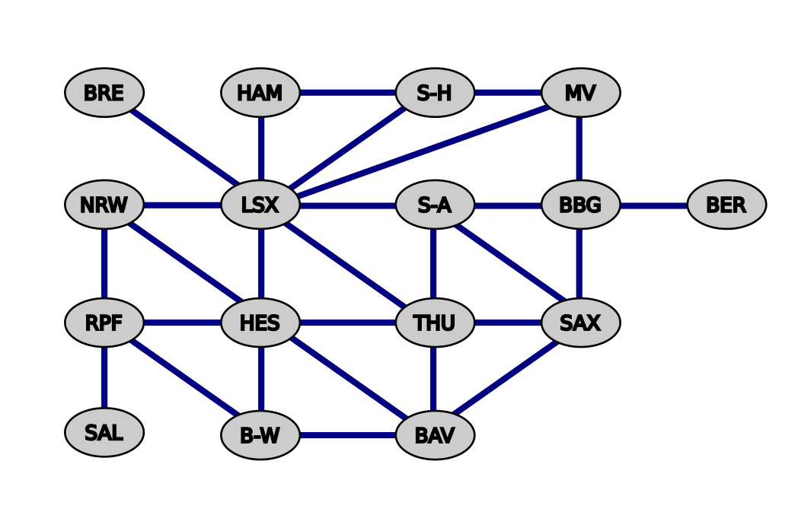

Graph Analysis
==============



In the image, you find a graph describing the adjancency of all 16
Federal States of Germany. Here is the same graph as a **Python
dictionary**:

``` {.sourceCode .python3}
germany = {
    "Baden-Württemberg": ["Rhineland-Palatinate", "Hesse", "Bavaria"],
    "Bavaria": ["Baden-Württemberg", "Hesse", "Thuringia", "Saxony"],
    "Berlin": ["Brandenburg"],
    "Brandenburg": ["Saxony", "Saxony-Anhalt", "Lower Saxony", "Mecklenburg-Vorpommern", "Berlin"],
    "Bremen": ["Lower Saxony"],
    "Hamburg": ["Schleswig-Holstein", "Lower Saxony"],
    "Hesse": ["North Rhine-Westphalia", "Lower Saxony", "Thuringia", "Bavaria", "Baden-Württemberg", "Rhineland-Palatinate"],
    "Mecklenburg-Vorpommern": ["Brandenburg", "Schleswig-Holstein", "Lower Saxony"],
    "Lower Saxony": ["Schleswig-Holstein", "Mecklenburg-Vorpommern", "Brandenburg", "Saxony-Anhalt", "Thuringia", "Hesse", "North Rhine-Westphalia", "Bremen", "Hamburg"],
    "North Rhine-Westphalia": ["Lower Saxony", "Hesse", "Rhineland-Palatinate"],
    "Rhineland-Palatinate": ["North Rhine-Westphalia", "Hesse", "Baden-Württemberg", "Saarland"],
    "Saarland": ["Rhineland-Palatinate"],
    "Saxony": ["Bavaria", "Thuringia", "Saxony-Anhalt", "Brandenburg"],
    "Saxony-Anhalt": ["Lower Saxony", "Brandenburg", "Saxony", "Thuringia"],
    "Schleswig-Holstein": ["Lower Saxony", "Hamburg", "Mecklenburg-Vorpommern"],
    "Thuringia": ["Hesse", "Lower Saxony", "Saxony-Anhalt", "Saxony", "Bavaria"]
}
```

Random Walk
-----------

Suppose we want to find out which of the 16 states is the most central
to the country. This is a concept called **centrality** applies to any
graph.

An easy way to measure the centrality is by simulating a **stochastic
process** or **Markov Chain**: We place a traveler in one state and have
them move around randomly across the borders. We count in which places
they end up most often:

``` {.sourceCode .python3}
import random
from collections import defaultdict

count = defaultdict(int)
location = "Berlin"
for _ in range(1_000_000):
    location = random.choice(germany[location])
    count[location] += 1
```

Visualize the location counts with

``` {.sourceCode .python3}
pd.Series(count).sort_index(ascending=False).plot.barh()
```

For a big graph, this approach is not very precise. Once again, linear
algebra comes to the rescue!

Adjacency Matrix
----------------

First, we need to describe the graph as an **adjacency matrix**:

``` {.sourceCode .python3}
import numpy as np

A = np.array([
    [ 
        1 if c2 in germany[c1] else 0
        for c2 in germany
    ]
    for c1 in germany
])
```

Every 1 in the matrix is a connection, a 0 means no connection. You
might recognize the similarity to a **distance matrix**, which in fact
can be used in graph analysis as well.

Display the matrix with:

``` {.sourceCode .python3}
import pandas as pd
import seaborn as sns

df = pd.DataFrame(A, index=list(germany), columns=list(germany))
sns.heatmap(df, cbar=False)
```

Transition Probabilities
------------------------

In a **Markov Chain model**, we can interpret the adjacency matrix as
probabilities by normalizing it, so that every column sums up to 1:

``` {.sourceCode .python3}
T = (C / C.sum(axis=1))
pd.DataFrame(T, index=list(germany), columns=list(germany)).round(2)
```

Markov Chain
------------

The Markov process is rather straightforward. You start with an
arbitrary **state distribution vector** that describes the initial
distribution of travelers:

``` {.sourceCode .python3}
v = np.ones(k) / k
```

Now, apply the Markov rule over multiple steps. In each step, the new
distribution vectors is obtained by a dot product with the transition
probabilities:

$$v_{t+1} = T \cdot v_t$$

In Python, a dot product takes care of everything:

``` {.sourceCode .python3}
for _ in range(10):
    v = np.dot(T, v)
    v = v / v.sum()  # normalize to column sum = 1 again
```

Plot the final distribution with:

``` {.sourceCode .python3}
pd.Series(v, index=germany.keys()).sort_index(ascending=False).plot.barh()
```

Eigenvectors
------------

An intriguing concept in linear algebra are **Eigenvectors** and
**Eigenvalues**. They describe central properties of matrices. An
eigenvector $\vec{v}$ and its corresponding eigenvalue $\lambda$ satisfy
the equation:

$$T \cdot \vec{v} = \lambda \vec{v}$$

Depending on the context, they can be interpreted as:

-   rotation axes of a linear transformation
-   representative linear combinations of data (Principal Component
    Analysis)

In our graph example, the principal eigenvectors (the one with the
highest eigenvalue) gives us the centrality directly. It can be
calculated directly:

``` {.sourceCode .python3}
eigvals, eigvecs = np.linalg.eig(T)
idx = np.argmax(np.abs(eigvals))  # find biggest value
centrality = np.abs(np.real(eigvecs[:, idx]))

pd.Series(centrality, index=germany.keys()).sort_index(ascending=False).plot.barh()
```

::: {.seealso}
[Eigenvalues and Eigenvectors on
Wikipedia](https://en.wikipedia.org/wiki/Eigenvalues_and_eigenvectors)
:::

Variations
----------

-   re-initialize the state vector and run more iterations. How does the
    distributions change?
-   what was the most central federal state before the German
    reunification?
-   after every step, add some chance that the traveler will teleport to
    a random state. This ios called a **damping factor**. Modify the
    loop before the normalization:

``` {.sourceCode .python3}
TELEPORTATIONS = ...

for _ in range(10):
    v = np.dot(T, v)
    v = v + TELEPORTATIONS
    ... 
```

Try lower and higher numbers for the TELEPORTATIONS and see how the
results change.

::: {.seealso}
The idea of a random traveler with teleportation is one of the most
important algorithms of our time: it was applied to web pages to rank
their importance in search results. This [Page Rank
Algorithm](https://en.wikipedia.org/wiki/PageRank) is one of the key
innovations that has put Google among the leading web corporations.
:::
