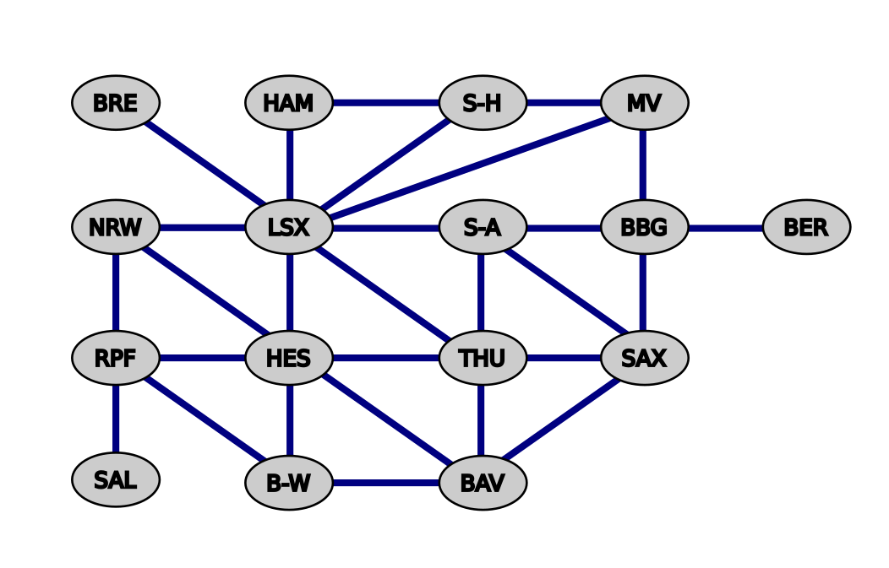

Graph Analysis
==============

In the image, you find a graph describing the adjancency of all 16 Federal States of Germany.
Here is the same graph as a **Python dictionary**:

.. code:: python3

    germany = {
        "Baden-Württemberg": ["Rhineland-Palatinate", "Hesse", "Bavaria"],
        "Bavaria": ["Baden-Württemberg", "Hesse", "Thuringia", "Saxony"],
        "Berlin": ["Brandenburg"],
        "Brandenburg": ["Saxony", "Saxony-Anhalt", "Lower Saxony", "Mecklenburg-Vorpommern", "Berlin"],
        "Bremen": ["Lower Saxony"],
        "Hamburg": ["Schleswig-Holstein", "Lower Saxony"],
        "Hesse": ["North Rhine-Westphalia", "Lower Saxony", "Thuringia", "Bavaria", "Baden-Württemberg", "Rhineland-Palatinate"],
        "Mecklenburg-Vorpommern": ["Brandenburg", "Schleswig-Holstein", "Lower Saxony"],
        "Lower Saxony": ["Schleswig-Holstein", "Mecklenburg-Vorpommern", "Brandenburg", "Saxony-Anhalt", "Thuringia", "Hesse", "North Rhine-Westphalia", "Bremen", "Hamburg"],
        "North Rhine-Westphalia": ["Lower Saxony", "Hesse", "Rhineland-Palatinate"],
        "Rhineland-Palatinate": ["North Rhine-Westphalia", "Hesse", "Baden-Württemberg", "Saarland"],
        "Saarland": ["Rhineland-Palatinate"],
        "Saxony": ["Bavaria", "Thuringia", "Saxony-Anhalt", "Brandenburg"],
        "Saxony-Anhalt": ["Lower Saxony", "Brandenburg", "Saxony", "Thuringia"],
        "Schleswig-Holstein": ["Lower Saxony", "Hamburg", "Mecklenburg-Vorpommern"],
        "Thuringia": ["Hesse", "Lower Saxony", "Saxony-Anhalt", "Saxony", "Bavaria"]
    }

Random Walk
-----------

Suppose we want to find out which of the 16 states is the most central to the country.
This is a concept called **centrality** applies to any graph.

An easy way to measure the centrality is by simulating a **stochastic process** or **Markov Chain**: We place a traveler in one state and have them move around randomly across the borders.
We count in which places they end up most often:

.. code:: python3

    import random
    from collections import defaultdict

    count = defaultdict(int)
    location = "Berlin"
    for _ in range(1_000_000):
        location = random.choice(germany[location])
        count[location] += 1

Visualize the location counts with

.. code:: python3

    pd.Series(count).sort_index(ascending=False).plot.barh()

For a big graph, this approach is not very precise. Once again, linear algebra comes to the rescue!

Adjacency Matrix
----------------

First, we need to describe the graph as an **adjacency matrix**:

.. code:: python3

    import numpy as np

    A = np.array([
        [ 
            1 if c2 in germany[c1] else 0
            for c2 in germany
        ]
        for c1 in germany
    ])

Every 1 in the matrix is a connection, a 0 means no connection.
You might recognize the similarity to a **distance matrix**, which in fact can be used in graph analysis as well.

Display the matrix with:

.. code:: python3

    import pandas as pd
    import seaborn as sns

    df = pd.DataFrame(A, index=list(germany), columns=list(germany))
    sns.heatmap(df, cbar=False)

Transition Probabilities
------------------------

In a **Markov Chain model**, we can interpret the adjacency matrix as probabilities by normalizing it, so that every column sums up to 1:

.. code:: python3

   T = (C / C.sum(axis=1))
   pd.DataFrame(T, index=list(germany), columns=list(germany)).round(2)

Markov Chain
------------

The Markov process is rather straightforward.
You start with an arbitrary **state distribution vector** that describes the initial distribution of travelers:

.. code:: python3

   v = np.ones(k) / k

Now, apply the Markov rule over multiple steps.
In each step, the new distribution vectors is obtained by a dot product with the transition probabilities:

.. math::

    v_{t+1} = T \cdot v_t

In Python, a dot product takes care of everything:

.. code:: python3

    for _ in range(10):
        v = np.dot(T, v)
        v = v / v.sum()  # normalize to column sum = 1 again

Plot the final distribution with:

.. code:: python3

   pd.Series(v, index=germany.keys()).sort_index(ascending=False).plot.barh()

Eigenvectors
------------

An intriguing concept in linear algebra are **Eigenvectors** and **Eigenvalues**.
They describe central properties of matrices. An eigenvector :math:`\vec{v}` and its corresponding eigenvalue :math:`\lambda` satisfy the equation:

.. math::

    T \cdot \vec{v} = \lambda \vec{v}

Depending on the context, they can be interpreted as:

- rotation axes of a linear transformation
- representative linear combinations of data (Principal Component Analysis)

In our graph example, the principal eigenvectors (the one with the highest eigenvalue) gives us the centrality directly. It can be calculated directly:

.. code:: python3

    eigvals, eigvecs = np.linalg.eig(T)
    idx = np.argmax(np.abs(eigvals))  # find biggest value
    centrality = np.abs(np.real(eigvecs[:, idx]))

    pd.Series(centrality, index=germany.keys()).sort_index(ascending=False).plot.barh()

.. seealso::

    `Eigenvalues and Eigenvectors on Wikipedia <https://en.wikipedia.org/wiki/Eigenvalues_and_eigenvectors>`__

Variations
----------

- re-initialize the state vector and run more iterations. How does the distributions change?
- what was the most central federal state before the German reunification?
- after every step, add some chance that the traveler will teleport to a random state. This ios called a **damping factor**. Modify the loop before the normalization:

.. code:: python3

    TELEPORTATIONS = ...

    for _ in range(10):
        v = np.dot(T, v)
        v = v + TELEPORTATIONS
        ... 

Try lower and higher numbers for the TELEPORTATIONS and see how the results change.

.. seealso::

    The idea of a random traveler with teleportation is one of the most important algorithms of our time: it was applied to web pages to rank their importance in search results.
    This `Page Rank Algorithm <https://en.wikipedia.org/wiki/PageRank>`__ is one of the key innovations that has put Google among the leading web corporations.  
