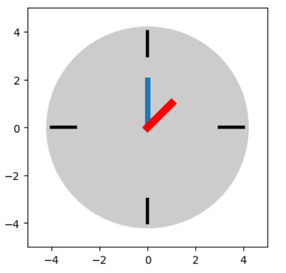

Linear Transformations
======================



In this exercise, you will apply matrices to transform vectors.

Clock
-----

Let\'s define a vector for a clock hand with an x and y coordinate:

$$\begin{aligned}
\vec{a} = \begin{bmatrix} 0 \\ 2 \end{bmatrix}
\end{aligned}$$

and

``` {.sourceCode .python3}
import numpy as np
from matplotlib import pyplot as plt

a = np.array([0, 2])
```

The following code plots the clock:

``` {.sourceCode .python3}
fig, ax = plt.subplots(figsize=(4, 4))
ax.add_patch( plt.Circle((0, 0), 4.2, color='#cccccc'))
ax.plot([3, 4], [0, 0], linewidth=3, color="black")
ax.plot([-3, -4], [0, 0], linewidth=3, color="black")
ax.plot([0, 0], [3, 4], linewidth=3, color="black")
ax.plot([0, 0], [-3, -4], linewidth=3, color="black")

# draw the clock
ax.plot([0, a[0]], [0, a[1]], linewidth=5)

plt.axis([-5, 5, -5, 5])
```

Rotation
--------

For linear transformations, use **matrices**. As long as the number of
dimensions is the same before and after the transformation, it is a
**square matrix**.

The most simple linear transformation is a rotation by 90°:

``` {.sourceCode .python3}
ROT = np.array([
    [0, 1],
    [-1, 0]]
)
```

To apply the rotation, use a matrix-vector product:

``` {.sourceCode .python3}
a = np.dot(ROT, a)
```

Then plot the clock again to see the change.

You can execute the dot product multiple times for multiple rotations.

Rotation by other angles
------------------------

You can rotate by arbitrary angles using trigonometric functions:

``` {.sourceCode .python3}
from math import sin, cos, radians

angle = radians(-45)

ROT = np.array([
    [cos(angle), sin(angle)],
    [-sin(angle), cos(angle)]
])
```

Try the following:

-   rotate the hand by half an hour
-   move the clocks hand back 10 minutes

Stretch
-------

Another type of linear transformations is a stretching operation. It
scales up the coordinates proportionally:

``` {.sourceCode .python3}
STRETCH = np.array([
    [2, 0],
    [0, 2]
    ])
a = np.dot(STRETCH, a)
```

Now shrink the hand again.

Shear
-----

The last operation modifies one coordinate but keeps the other constant.
You can create perspective projections with this mechanism easily.

``` {.sourceCode .python3}
SHEAR = np.array([
    [1, -2],
    [0, 1]
    ])
a = np.dot(SHEAR, a)
```

Another hand
------------

You can add a second hand to the clock. First, make the vector longer:

``` {.sourceCode .python3}
a = np.array([0, 2, 1, 1])
```

Add an extra line to the plotting code block:

``` {.sourceCode .python3}
ax.plot([0, a[2]], [0, a[3]], linewidth=7, color="red")
```

The matrices now are a bit more complicated - they are (4, 4) square
matrices. For instance to rotate both hands independently:

``` {.sourceCode .python3}
alpha = radians(120)
beta = radians(10)

ROT = np.array([
    [ cos(alpha), sin(alpha), 0, 0],
    [-sin(alpha), cos(alpha), 0, 0],
    [0, 0, cos(beta), sin(beta)],
    [0, 0, -sin(beta), cos(beta)]
])
a = np.dot(ROT, a)
```
