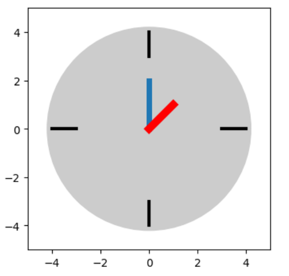

Linear Transformations
======================

In this exercise, you will apply matrices to transform vectors.

Clock
-----

Let's define a vector for a clock hand with an x and y coordinate:

.. math::

    \vec{a} = \begin{bmatrix} 0 \\ 2 \end{bmatrix}

and

.. code:: python3

    import numpy as np
    from matplotlib import pyplot as plt

    a = np.array([0, 2])

The following code plots the clock:

.. code:: python3

    fig, ax = plt.subplots(figsize=(4, 4))
    ax.add_patch( plt.Circle((0, 0), 4.2, color='#cccccc'))
    ax.plot([3, 4], [0, 0], linewidth=3, color="black")
    ax.plot([-3, -4], [0, 0], linewidth=3, color="black")
    ax.plot([0, 0], [3, 4], linewidth=3, color="black")
    ax.plot([0, 0], [-3, -4], linewidth=3, color="black")

    # draw the clock
    ax.plot([0, a[0]], [0, a[1]], linewidth=5)

    plt.axis([-5, 5, -5, 5])

Rotation
--------

For linear transformations, use **matrices**. As long as the number of dimensions is the same before and after the transformation, it is a **square matrix**.

The most simple linear transformation is a rotation by 90°:

.. code:: python3

    ROT = np.array([
        [0, 1],
        [-1, 0]]
    )

To apply the rotation, use a matrix-vector product:

.. code:: python3

    a = np.dot(ROT, a)

Then plot the clock again to see the change.

You can execute the dot product multiple times for multiple rotations.

Rotation by other angles
------------------------

You can rotate by arbitrary angles using trigonometric functions:

.. code:: python3

    from math import sin, cos, radians

    angle = radians(-45)

    ROT = np.array([
        [cos(angle), sin(angle)],
        [-sin(angle), cos(angle)]
    ])

Try the following:

- rotate the hand by half an hour
- move the clocks hand back 10 minutes

Stretch
-------

Another type of linear transformations is a stretching operation.
It scales up the coordinates proportionally:

.. code:: python3

    STRETCH = np.array([
        [2, 0],
        [0, 2]
        ])
    a = np.dot(STRETCH, a)

Now shrink the hand again.

Shear
-----

The last operation modifies one coordinate but keeps the other constant.
You can create perspective projections with this mechanism easily.   

.. code:: python3

    SHEAR = np.array([
        [1, -2],
        [0, 1]
        ])
    a = np.dot(SHEAR, a)

Another hand
------------

You can add a second hand to the clock.
First, make the vector longer:

.. code:: python3

    a = np.array([0, 2, 1, 1])

Add an extra line to the plotting code block:

.. code:: python3

    ax.plot([0, a[2]], [0, a[3]], linewidth=7, color="red")

The matrices now are a bit more complicated - they are (4, 4) square matrices. For instance to rotate both hands independently:

.. code:: python3

    alpha = radians(120)
    beta = radians(10)

    ROT = np.array([
        [ cos(alpha), sin(alpha), 0, 0],
        [-sin(alpha), cos(alpha), 0, 0],
        [0, 0, cos(beta), sin(beta)],
        [0, 0, -sin(beta), cos(beta)]
    ])
    a = np.dot(ROT, a)

