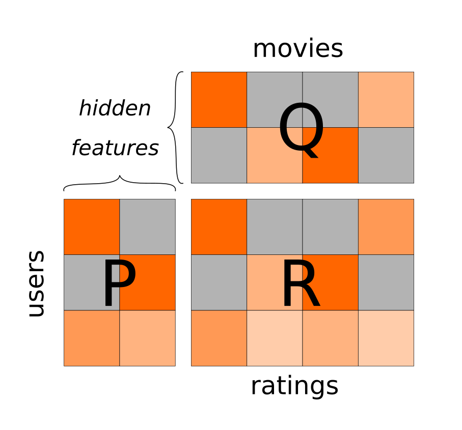

Recommender
===========



In this exercise, you will take a look at **Matrix Factorization**. It
can be used to build a straightforward **recommender system**.

Let\'s consider 5 movies and 5 persons:

``` {.sourceCode .python3}
movies = ["Titanic", "Barbie", "Shrek", "Dune", "Star Trek"]
persons = ["Ada", "Bashir", "Choi", "Deryl", "Elena"]
```

Each person has rated some of the movies on a scale of 1 (worst) to 5
(best). You can store these conveniently in a `pandas` DataFrame:

``` {.sourceCode .python3}
R = np.array([
    [None, 3, 1, 4, 1],
    [2, 4, 1, 5, None],
    [3, 4, None, 5, None],
    [5, None, 4, 2, 5],
    [4, 1, 5, None, None],
])
R = pd.DataFrame(ratings, index=movies, columns=persons)
```

Matrix Factorization
--------------------

Now we will build two other matrices **P** and **Q**. They add an
**extra dimension** to the data. For better understanding, we will call
this the *\"genre\"* of the movies. We will use two genres, *\"drama\"*
and *\"sci-fi\"*.

The first matrix **P** indicates how much each movie belongs to each
genre. Add the remaining values:

``` {.sourceCode .python3}
P = np.array([
    [5, 1],   # [drama, scifi] for Titanic
    ...       #
])
P.shape  # should be (5, 2)
```

The second matrix **Q** indicates how much each user likes each genre.
Note that the dimensions are reversed here. Add the remaining values as
well:

``` {.sourceCode .python3}
Q = np.array([
    [0, ...],   # drama
    [4, ...],   # sci-fi
])
Q.shape  # should be (2, 5)
```

Rebuild the rating matrix
-------------------------

Now comes the linear algebra trick: We use **Matrix Multiplication** to
reconstruct the ratings matrix. Lets call this matrix S:

``` {.sourceCode .python3}
S = np.dot(P, Q)
```

It may help to normalize the values to a maximum of five:

``` {.sourceCode .python3}
S = 5 * S / S.max()
S.round(1)
```

Frobenius Norm
--------------

If we chose the values in P and Q well, the matrices should be similar.
Next, we will use the **Frobenius Norm** to calculate their difference.
It is practically the same as the **L2 Norm**.

Calculating the difference can be tricky because **R** contains missing
values, but the `pandas` library takes that burden from us:

``` {.sourceCode .python3}
diff = R - S
np.sqrt((diff ** 2).sum().sum())
```

Optimize
--------

Change the values in **P** and **Q** so that the Frobenius Norm becomes
smaller.

::: {.hint}
::: {.admonition-title}
Hint
:::

There are many methods to factorize matrices automatically, like NMF or
SVD. I kept the manual approach mainly for illustrative purposes.
:::

Predict
-------

Based on the predicted ratings in **S**, what movie would you recommend
to **Elena**?

::: {.seealso}
-   [Matrix Factorization on
    Wikipedia](https://en.wikipedia.org/wiki/Matrix_factorization_(recommender_systems))
-   [Non-Negative Matrix Factorization
    (NMF)](https://scikit-learn.org/stable/modules/generated/sklearn.decomposition.NMF.html)
-   [larger recommender example using
    NMF](https://www.kaggle.com/code/bastisei/movie-recommendation-system-using-svd-and-nmf)
:::
